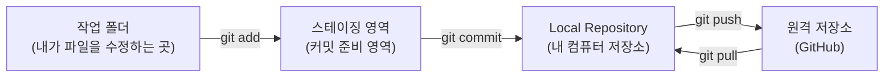
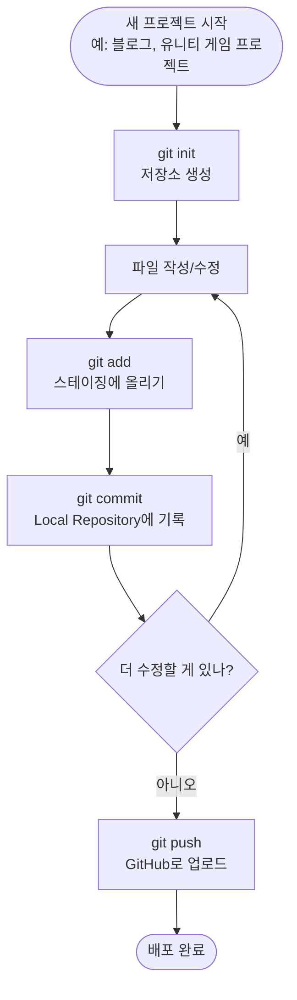
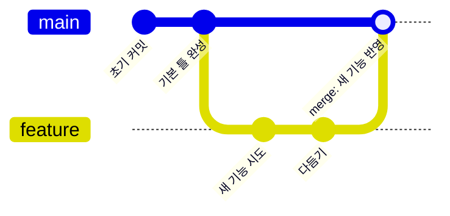
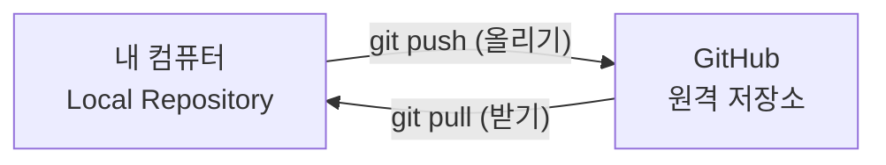
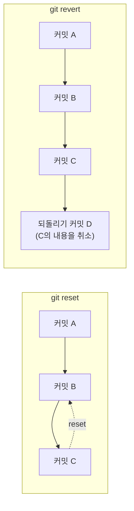

이번 주에 Git과 GitHub를 처음 배우고, 이 블로그를 직접 만들어서 인터넷에 배포까지 해봤습니다. 전공자가 아니어도 이해할 수 있도록, 일상적인 비유를 곁들여서 배운 명령어들을 정리해봅니다.

## 1. Git이 하는 일, 큰 그림부터

Git으로 코드를 관리할 때, 내 파일은 사실 여러 "단계"를 거쳐서 저장됩니다. 게임에서 "임시 저장 → 진짜 세이브"를 하는 것과 비슷하다고 생각하면 훨씬 이해가 쉽습니다.

비전공자 입장에서 쉽게 와닿도록 비유로 다시 정리하면 이렇습니다.

| 단계 | Git 용어 | 비유 |
|---|---|---|
| 1 | 작업 폴더 | 지금 글을 쓰고 있는 워드 문서 (아직 저장 안 함) |
| 2 | 스테이징 영역 | "이번에 저장할 부분"만 골라 담는 장바구니 |
| 3 | Local Repository | 내 컴퓨터에 남는 저장 기록 (세이브 포인트 모음) |
| 4 | 원격 저장소(GitHub) | 인터넷 클라우드 창고 (다른 곳에서도 꺼내 쓸 수 있음) |

## 2. 이번 주 배운 명령어 표

| 명령어 | 언제 쓰나 |
|---|---|
| `git init` | 지금 있는 폴더를 Git 저장소로 새로 만들고 싶을 때 |
| `git add 파일명` (또는 `git add .`) | 수정한 파일을 스테이징 영역(장바구니)에 담아서 "저장할 준비"를 할 때 |
| `git commit -m "메시지"` | 장바구니에 담은 내용을 Local Repository에 하나의 세이브 포인트로 남기고 싶을 때 |
| `git branch 브랜치명` | 원본 코드를 건드리지 않고 새로운 작업 공간(브랜치)을 만들고 싶을 때 |
| `git checkout 브랜치명` | 다른 브랜치로 옮겨가서 작업하고 싶을 때 |
| `git merge 브랜치명` | 다른 브랜치에서 작업한 내용을 지금 브랜치로 합치고 싶을 때 |
| `git push` | 내 Local Repository의 세이브 포인트들을 GitHub(클라우드 창고)로 올리고 싶을 때 |
| `git pull` | GitHub에 있는 최신 내용을 내 컴퓨터로 받아오고 싶을 때 |
| `git reset` | 세이브 포인트를 지우고 그 전 상태로 되돌리고 싶을 때 |
| `git revert` | 이미 올라간 세이브 포인트는 지우지 않고, "되돌리는 새 기록"을 추가하고 싶을 때 |

## 3. 저장소 만들기 → 커밋까지의 흐름

이번 블로그를 처음 시작할 때 실제로 밟은 순서입니다. 다음에 할 유니티 프로젝트(로그 기반 게임)도 결국 이 순서 그대로 시작하게 됩니다.

## 4. 브랜치 만들고 합치기 (merge)

혼자 작업할 때도 새로운 기능을 시험해볼 때는 브랜치를 따로 파는 습관을 들이는 게 좋다고 배웠습니다. 예를 들어 유니티 로그 기반 게임 프로젝트에서 "새 기능 하나를 시험 삼아 만들어볼 때" 원본(main)은 그대로 두고 따로 작업할 수 있습니다.

- `git branch feature` → main에서 갈라져 나온 `feature` 브랜치 생성 (원본은 안전하게 그대로)
- `git checkout feature` → 작업할 브랜치로 이동
- (커밋 여러 번)
- `git checkout main` → 다시 main으로 돌아옴
- `git merge feature` → feature에서 작업한 내용을 main에 합치기 (시험이 성공하면 본체에 반영)

## 5. push와 pull, 방향만 기억하면 끝

저는 처음에 push와 pull 방향이 헷갈렸는데, "push = 밀어서 올린다", "pull = 당겨서 받는다"라고 외우니까 헷갈리지 않았습니다. 나중에 다른 컴퓨터에서 유니티 프로젝트를 이어서 할 때도 `git pull`로 최신 내용을 받아오면 됩니다.

## 6. 되돌리기: reset vs revert

똑같이 "되돌리기"지만 둘의 성격이 달라서 표로 정리했습니다.

| 명령어 | 특징 |
|---|---|
| `git reset` | 세이브 포인트 자체를 지우고 예전 상태로 돌아감 (기록이 사라짐) |
| `git revert` | 세이브 포인트는 그대로 두고, "되돌리는 내용의 새 기록"을 추가함 (기록이 남음) |

이미 GitHub에 push까지 해서 다른 곳(예: 배포된 블로그, 또는 팀원이 받아간 유니티 프로젝트)에서 쓰이고 있는 기록은, 지우는 `reset`보다는 흔적을 남기는 `revert`가 더 안전하다고 배웠습니다.

## 정리

이번 주는 딱 아래 순서만 기억하면 됩니다.

1. `git init`으로 저장소를 만든다
2. 파일을 고치고 `git add`로 장바구니(스테이징)에 담는다
3. `git commit`으로 Local Repository에 세이브 포인트를 남긴다
4. 필요하면 `git branch` / `git checkout`으로 브랜치를 나눠 작업하고 `git merge`로 합친다
5. `git push`로 GitHub에 올리고, 다른 곳에서 받아올 땐 `git pull`
6. 실수했을 땐 `git reset`이나 `git revert`로 되돌린다

다음에 유니티로 로그 기반 게임 프로젝트를 시작할 때도 결국 이 순서(저장소 생성 → add → commit → push, 필요하면 branch/merge)를 그대로 쓰게 될 거라, 이번 주에 익힌 흐름을 그대로 적용해볼 생각입니다.
