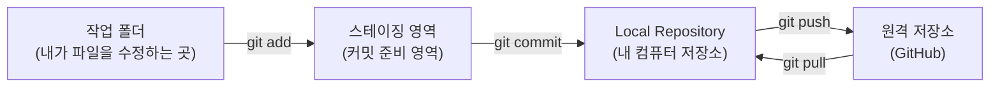
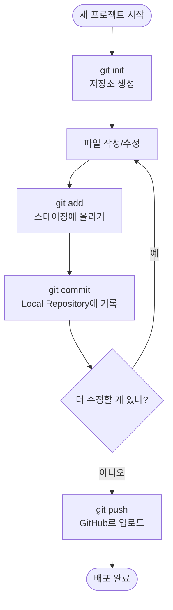
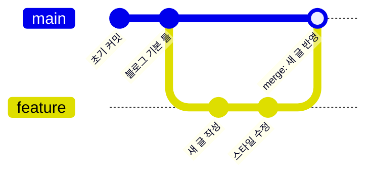
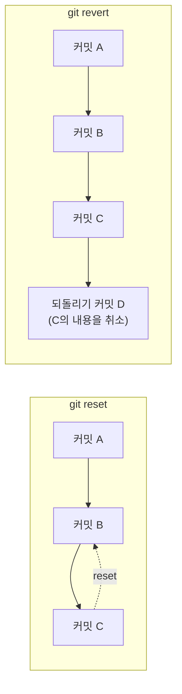

이번 주에 Git과 GitHub를 처음 배우고, 이 블로그를 직접 만들어서 인터넷에 배포까지 해봤습니다. 그 과정에서 배운 명령어들을 저와 같은 초보자를 위해 정리해봅니다.

## 1. Git이 하는 일, 큰 그림부터

Git으로 코드를 관리할 때, 내 파일은 사실 여러 "단계"를 거쳐서 저장됩니다. 이걸 이해하면 명령어를 왜 쓰는지 훨씬 잘 이해가 됩니다.

- **작업 폴더**: 내가 지금 실제로 코드를 고치고 있는 공간
- **스테이징 영역**: "이번 커밋에 포함시킬 파일들"을 잠깐 모아두는 공간
- **Local Repository**: 커밋이 실제로 기록되는, 내 컴퓨터 안의 저장소
- **원격 저장소(GitHub)**: 인터넷에 있는 저장소로, 다른 사람과 공유하거나 배포할 때 씀

## 2. 이번 주 배운 명령어 표

| 명령어 | 언제 쓰나 |
|---|---|
| `git init` | 지금 있는 폴더를 Git 저장소로 새로 만들고 싶을 때 |
| `git add 파일명` (또는 `git add .`) | 수정한 파일을 스테이징 영역에 올려서 "커밋할 준비"를 할 때 |
| `git commit -m "메시지"` | 스테이징에 올린 내용을 Local Repository에 하나의 기록(버전)으로 남기고 싶을 때 |
| `git branch 브랜치명` | 원본 코드를 건드리지 않고 새로운 작업 공간(브랜치)을 만들고 싶을 때 |
| `git checkout 브랜치명` | 다른 브랜치로 옮겨가서 작업하고 싶을 때 |
| `git merge 브랜치명` | 다른 브랜치에서 작업한 내용을 지금 브랜치로 합치고 싶을 때 |
| `git push` | 내 Local Repository의 커밋들을 GitHub(원격 저장소)로 올리고 싶을 때 |
| `git pull` | GitHub에 있는 최신 내용을 내 컴퓨터로 받아오고 싶을 때 |
| `git reset` | 커밋을 취소하고 그 전 상태로 되돌리고 싶을 때 |
| `git revert` | 이미 올라간 커밋을 지우지 않고, "되돌리는 새 커밋"을 남기고 싶을 때 |

## 3. 저장소 만들기 → 커밋까지의 흐름

블로그 프로젝트를 처음 시작할 때 실제로 밟은 순서입니다.

## 4. 브랜치 만들고 합치기 (merge)

혼자 작업할 때도 새로운 기능을 시험해볼 때는 브랜치를 따로 파는 습관을 들이는 게 좋다고 배웠습니다.

- `git branch feature` → main에서 갈라져 나온 `feature` 브랜치 생성
- `git checkout feature` → 작업할 브랜치로 이동
- (커밋 여러 번)
- `git checkout main` → 다시 main으로 돌아옴
- `git merge feature` → feature에서 작업한 내용을 main에 합치기

## 5. push와 pull, 방향만 기억하면 끝

저는 처음에 push와 pull 방향이 헷갈렸는데, "push = 밀어서 올린다", "pull = 당겨서 받는다"라고 외우니까 헷갈리지 않았습니다.

## 6. 되돌리기: reset vs revert

똑같이 "되돌리기"지만 둘의 성격이 달라서 표로 정리했습니다.

| 명령어 | 특징 |
|---|---|
| `git reset` | 커밋 기록 자체를 지우고 예전 상태로 돌아감 (기록이 사라짐) |
| `git revert` | 커밋 기록은 그대로 두고, "되돌리는 내용의 새 커밋"을 추가함 (기록이 남음) |

이미 GitHub에 push까지 해서 다른 곳(예: 배포된 블로그)에서 쓰이고 있는 커밋은, 기록을 지우는 `reset`보다는 흔적을 남기는 `revert`가 더 안전하다고 배웠습니다.

## 정리

이번 주는 딱 아래 순서만 기억하면 됩니다.

1. `git init`으로 저장소를 만든다
2. 파일을 고치고 `git add`로 스테이징한다
3. `git commit`으로 Local Repository에 기록을 남긴다
4. 필요하면 `git branch` / `git checkout`으로 브랜치를 나눠 작업하고 `git merge`로 합친다
5. `git push`로 GitHub에 올리고, 다른 곳에서 받아올 땐 `git pull`
6. 실수했을 땐 `git reset`이나 `git revert`로 되돌린다

다음 주에는 오늘 헷갈렸던 부분들 위주로 더 연습해볼 예정입니다.
