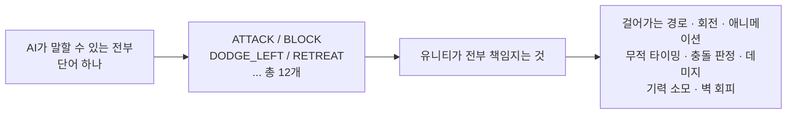
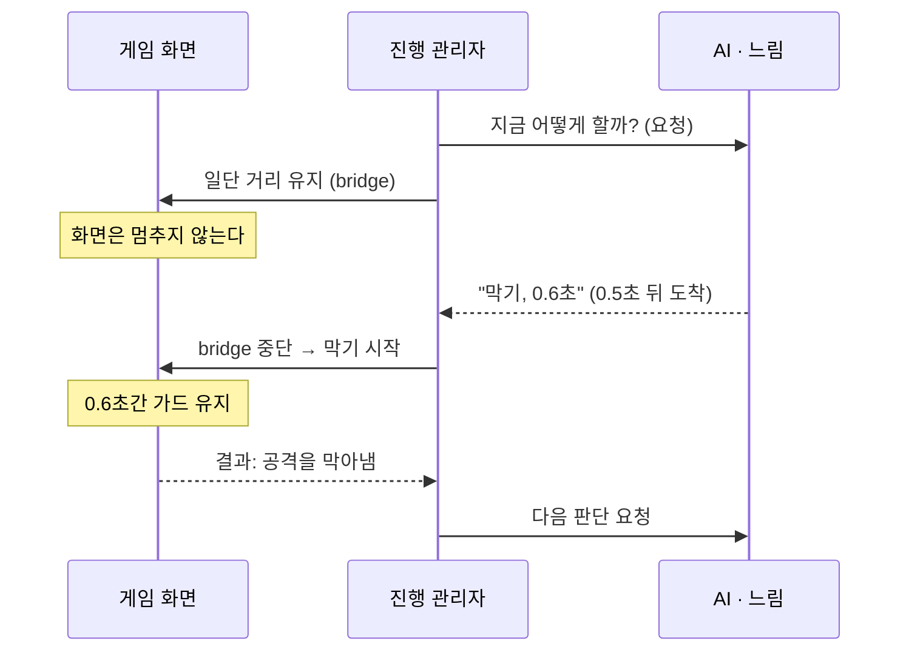
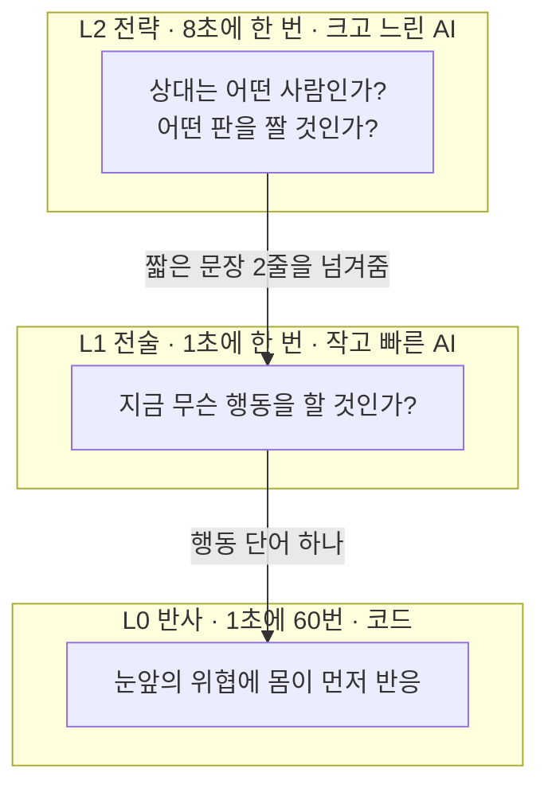
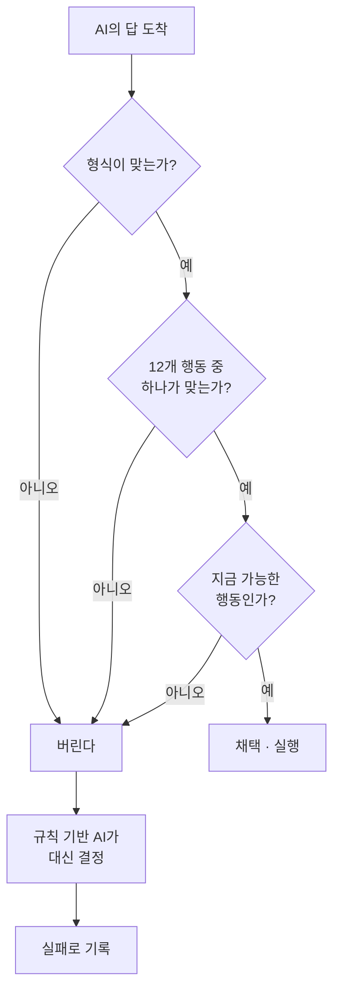
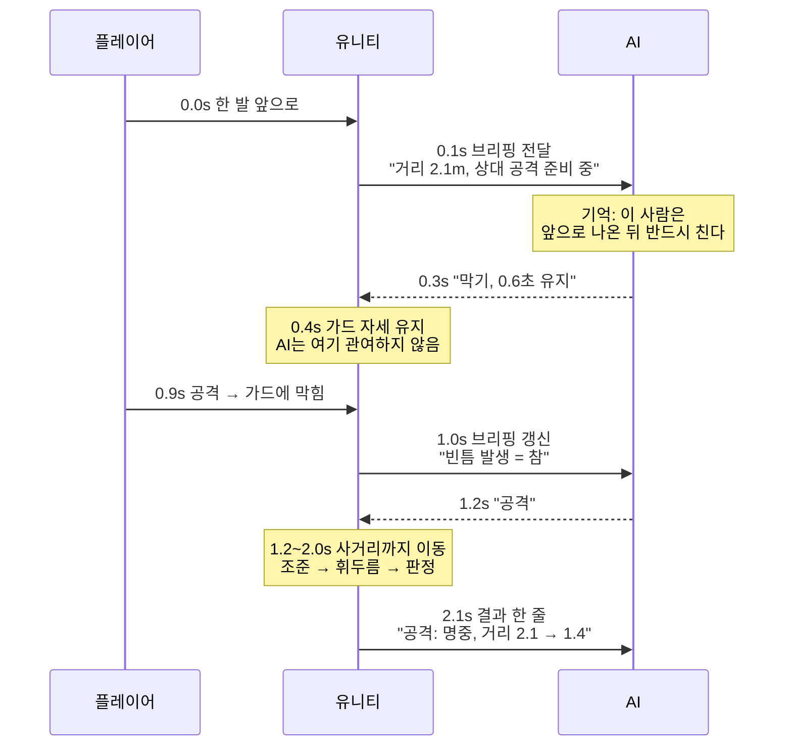

## 들어가며 (Situation)

유니티로 **1대1 근접 전투 아레나**를 만들고 있습니다. 사람이 한 명, AI가 한 명. 서로 다가가고, 때리고, 막고, 피합니다.

문제는 그 AI를 어떻게 만드느냐입니다.

게임 속 적 캐릭터는 대부분 **거대한 규칙표**입니다. "체력이 30% 아래면 도망친다", "거리가 2미터 안이면 공격한다" 같은 조건문을 잔뜩 쌓아 올린 것이죠. 잘 만들면 꽤 그럴듯하지만, 몇 판만 해 보면 패턴이 읽힙니다. 그리고 그 표에 적혀 있지 않은 상황은 영원히 대응하지 못합니다.

제가 만들려는 건 다른 쪽입니다. **상황을 읽고 전략을 고르는** 상대. ChatGPT 같은 언어 모델이 매 순간 경기를 보고 "지금은 막고 기다리는 게 낫겠다"를 직접 판단하는 AI입니다.

> **비전공자를 위한 용어 세 개**
>
> - **프레임(frame)** — 게임이 화면을 한 번 그리는 것. 보통 1초에 60번 그립니다. 한 프레임은 약 0.016초.
> - **LLM(대규모 언어 모델)** — ChatGPT처럼 글을 읽고 글로 답하는 AI. 이 글에서는 그냥 "AI"라고 부르겠습니다.
> - **에이전트(agent)** — 질문에 한 번 답하고 끝나는 게 아니라, **보고 → 판단하고 → 행동하고 → 결과를 다시 보는** 순환을 계속 도는 AI.

목표는 "강한 AI"가 아닙니다. 최종적으로는 사람이 **"이 AI가 내 스타일에 맞춰 변하고 있다"고 느끼는지**를 확인하는 연구용 프로토타입입니다. 그래서 나중에 규칙 기반 AI와 나란히 놓고 비교 실험을 해야 합니다.

이 글은 그 첫 번째 벽에 대한 이야기입니다.

---

## 문제 상황 (Task)

기획서를 쓰고 나서 숫자를 나란히 적어 봤을 때, 문제가 한눈에 보였습니다.

| 무엇 | 걸리는 시간 |
|------|-------------|
| 게임 한 프레임 | **약 0.016초** (1초에 60번) |
| 공격 한 번의 빈틈(후딜) | 0.45초 |
| AI가 한 번 대답하는 시간 | **0.3 ~ 0.8초** (로컬 소형 모델이라도 0.1~0.3초) |

AI에게 한 번 물어보고 답을 기다리는 동안, 게임은 **30프레임쯤 지나갑니다.** 그 사이에 상대는 이미 다가와서 때리고 물러났습니다.

정리하면 제약은 세 가지였습니다.

| 제약 | 내용 | 지키지 못하면 |
|------|------|---------------|
| **지연** | AI의 응답은 프레임보다 두 자릿수 느리다 | 게임이 성립하지 않음 |
| **불안정** | 네트워크가 끊기거나 AI가 엉뚱한 답을 할 수 있다 | 실험 도중 게임이 멈춤 |
| **실험 통제** | 나중에 규칙 AI와 비교해야 한다 | "좋아진 게 AI 덕인지 코드 덕인지" 구분 불가 |

여기서 가장 먼저 든 생각은 "더 빠른 모델을 쓰면 되지 않나?"였습니다. 하지만 계산이 맞지 않습니다. 내 컴퓨터에서 돌리는 작은 모델도 0.1초는 걸리는데, 한 프레임은 0.016초입니다. **속도로는 메울 수 없는 격차입니다.**

그러니까 이건 최적화 문제가 아니라 **구조 문제**였습니다.

---

## 해결 과정 (Action)

### 1. 먼저 막다른 길 두 개를 확인했다

구조를 바꾸기 전에, 자연스럽게 떠오르는 두 가지 방식이 왜 안 되는지부터 정리했습니다.

**막다른 길 ① — 프레임마다 물어보기**

가장 단순한 발상이고, 가장 빨리 무너집니다. 1초에 60번 AI를 호출한다는 뜻인데, 한 번 답하는 데 0.5초가 걸리므로 애초에 물리적으로 불가능합니다. 비용도 감당할 수 없고요.

**막다른 길 ② — 라운드가 시작할 때 한 번만 물어보기**

"이번 판은 공격적으로 간다"를 한 번 정하고 그대로 밀고 나가는 방식입니다. 지연 문제는 사라집니다. 그런데 이건 AI가 아니라 **난이도 설정**입니다. 플레이어가 무엇을 하든 반응이 없으니, 상호작용 자체가 없어집니다.

**그래서 단위를 바꿨습니다.** 프레임도 아니고 라운드도 아닌, 그 사이의 **'결정(decision)'** 을 기본 단위로 잡았습니다.

- 하나의 결정에는 **유효기간(0.3~1.5초)** 이 있습니다.
- 유효기간이 끝나면 **결과 한 줄**이 생깁니다. (예: `"뒤로 회피: 성공, 거리 1.9 → 4.1"`)
- 결정 하나 = 결과 하나로 딱 맞아떨어집니다.

| 판단 단위 | 반응성 | 호출 비용 | 상호작용 | 판정 |
|-----------|--------|-----------|----------|------|
| 프레임 (0.016초) | 최고 | 불가능 | — | ❌ 물리적으로 불가 |
| **결정 (0.3~1.5초)** | 충분함 | 감당 가능 | 있음 | ✅ **채택** |
| 라운드 (수십 초) | 없음 | 저렴 | 없음 | ❌ 난이도 프리셋과 다를 바 없음 |

부수적인 이득이 하나 더 있었습니다. 결정과 결과가 1:1이라 **기록(로그) 한 줄이 곧 분석 단위**가 됩니다. 나중에 "AI가 몇 번 판단했고, 그중 몇 번이 좋은 판단이었나"를 세는 일이 그냥 줄 세기가 됩니다.

### 2. 역할을 나눴다 — AI는 '무엇을', 유니티는 '어떻게'

권투 경기를 떠올려 봅시다. 코치는 링 밖에서 **"막아!"** 한 마디를 외칩니다. 실제로 팔을 들어 올리고, 각도를 잡고, 무게중심을 옮기는 건 선수의 몸입니다. 코치가 근육 하나하나를 원격 조종하려 들면 경기가 성립하지 않습니다.

이 프로젝트에서 AI는 코치이고, 유니티는 선수의 몸입니다.



경계선을 표로 못 박아 두었습니다.

| AI가 정하는 것 | 유니티가 정하는 것 |
|----------------|--------------------|
| 지금 공격할지, 막을지, 피할지 | 어느 경로로 다가갈지 |
| 어느 방향으로 피할지 | 몇 도로 회전할지, 어떤 애니메이션을 재생할지 |
| 이 행동을 몇 초 유지할지 | 무적 프레임이 언제 시작되고 끝나는지 |
| 어느 정도 거리를 유지할지 | 공격이 맞았는지, 막혔는지, 빗나갔는지 |

이 경계선이 지연 문제를 절반쯤 풉니다. **코치는 가끔 말해도 되지만, 몸은 1/60초마다 계속 움직이기 때문입니다.** AI가 0.5초 동안 생각하는 사이에도 캐릭터는 멈추지 않고 이전 지시를 수행합니다.

기대하지 않았던 이득도 있었습니다. AI가 이상한 소리를 해도 **물리 법칙까지 이상해지지는 않습니다.** 예를 들어 AI가 `RETREAT`(후퇴)를 골랐는데 뒤가 아레나 벽이라면, 코드가 알아서 옆으로 도는 동작으로 바꿉니다.

> 이건 판단이 아니라 물리 상식입니다. **"벽에 몰렸는데도 계속 뒤로 가는 바보 같은 AI"를 프롬프트로 고치려 하면 안 됩니다.** 상식은 코드가 보장해야 안정적입니다. AI에게는 "왜 지금 물러나야 하는가"만 맡깁니다.

### 3. 기다리는 동안 무엇을 할지 정했다 (가장 오래 헤맨 부분)

역할을 나눠도 **답을 기다리는 0.5초**는 그대로 남습니다. 여기서 시행착오를 겪었습니다.

**시도 ① 답이 올 때까지 가만히 서 있기**

가장 먼저 해 본 방식입니다. 결과는 최악이었습니다. AI가 0.5초마다 한 번씩 **얼어붙는 것처럼** 보였습니다. 사람 눈에는 "생각이 깊은 AI"가 아니라 "렉 걸린 AI"입니다.

**시도 ② 이전 행동을 계속 유지하기**

얼어붙지는 않습니다. 그런데 위험합니다. 직전 결정이 `ATTACK`이었다면, 다음 지시를 기다리는 동안 계속 공격 자세로 서 있게 됩니다. 이미 상황이 바뀌었는데도요.

**채택 ③ '무해한' 행동으로 시간 벌기**

최종적으로는 답을 기다리는 동안 **거리 유지(MAINTAIN_DISTANCE)** 를 하도록 했습니다. 상대를 바라보며 간격만 유지하는, 이득도 손해도 아닌 행동입니다. 이걸 다리를 놓는다는 뜻으로 **bridge 행동**이라고 부르기로 했습니다.

여기서 스스로 정한 규칙이 하나 있습니다.

> **bridge 행동은 '이득'이 아니라 '무해'해야 한다.**
>
> 만약 이 대기 행동을 똑똑하게 만들면, 나중에 실험에서 "AI가 잘한 것"과 "대기 로직이 잘한 것"이 섞여 버립니다. 일부러 평범하게 만들어야 합니다.



### 4. 시간 축을 셋으로 쪼갰다 (핵심 아이디어)

여기까지 왔는데도 남는 문제가 있었습니다. **좋은 판단일수록 시간이 오래 걸린다**는 것입니다.

"지금 막아야 한다"는 빨리 나와야 합니다. 그런데 "이 사람은 다가온 직후에 반드시 공격하는 습관이 있다" 같은 **해석**은 시간이 걸립니다. 하나의 AI에게 둘 다 시키면 둘 다 망합니다.

사람의 생각을 떠올려 보면 힌트가 있습니다.

| 사람의 생각 | 걸리는 시간 |
|-------------|-------------|
| 뜨거운 냄비에 손이 닿으면 손을 뗀다 | 생각하기 **전에** |
| 운전 중 "지금 차선 바꿀까?" | 1초쯤 |
| "이 사람은 원래 성격이 급하구나" | 몇 분에 걸쳐 |

이 셋은 속도도 다르고 담당하는 뇌 부위도 다릅니다. 그래서 의사결정을 **주기가 다른 세 층**으로 쪼갰습니다.



| 계층 | 주기 | 무엇을 정하나 | 누가 |
|------|------|---------------|------|
| **L0 반사** | 1초에 60번 | 눈앞의 위협에 즉각 반응 | 코드 (실험 중에는 꺼 둠) |
| **L1 전술** | 0.3 ~ 1.0초 | 지금 무슨 행동을 할까 | 작고 빠른 AI |
| **L2 전략** | 5 ~ 10초 | 이 사람은 어떤 사람인가 | 크고 느린 AI |

**승부처는 L2입니다.** "플레이어는 회피한 직후에 반드시 반격한다" 같은 해석은 **실시간으로 뽑을 필요가 없습니다.** 느리게, 가끔, 깊게 생각해서 짧은 문장 두어 개로 만들어 두면, L1은 그 문장을 곁눈질하며 빠르게 결정할 수 있습니다.

L2가 만들어 내는 결과물은 이런 모양입니다.

> **상대 분석**: 이 플레이어는 거리를 좁힌 직후 반드시 공격을 시작한다. 방어보다 회피를 선호한다.
> **다음 방침**: 접근을 허용하되 첫 공격을 흘리고, 그 직후의 빈틈을 노려라.

이 두 줄이 L1에게 건네지는 전부입니다. 짧기 때문에 L1의 속도를 떨어뜨리지 않습니다.

이 구조 하나가 세 가지 문제를 동시에 풉니다.

| 문제 | 어떻게 풀리는가 |
|------|-----------------|
| **지연** | L1은 짧게 묻고, L2는 뒤에서 따로 돈다. **L2가 늦어져도 게임에는 아무 영향이 없다** (예전 분석을 계속 쓰면 그만) |
| **비용** | 크고 비싼 모델 호출이 한 판에 열 번 안팎으로 줄어든다 |
| **연구 가치** | "L2를 꺼 보면 무슨 일이 생기는가"가 **그대로 실험 조건이 된다** |

마지막 줄이 특히 중요했습니다. 나중에 "AI가 좋아진 이유가 **맥락 이해 때문**"이라고 말하려면, 맥락 이해만 꺼 본 조건이 필요합니다. 구조를 이렇게 짜 두니 그 조건이 스위치 하나로 만들어졌습니다.

### 5. AI가 볼 수 있는 세계를 하나로 묶었다

AI는 게임 화면을 보지 않습니다. 유니티가 뭔지도 모릅니다. 매 순간 이런 **상황 브리핑** 한 장만 받습니다.

```json
{
  "distance": 2.1,
  "ai_hp": 62, "ai_stamina": 0.41,
  "player_hp": 78, "player_stamina": 0.66,
  "player_action": "ATTACK_WINDUP",
  "incoming_attack": true,
  "opening_available": false,
  "memory_highlights": [
    "상대는 최근 5번 중 4번 먼저 공격했다",
    "상대는 공격 전에 항상 한 발 앞으로 나온다"
  ],
  "available_actions": ["IDLE","CHASE","RETREAT","MAINTAIN_DISTANCE",
                        "STRAFE_LEFT","STRAFE_RIGHT","BLOCK",
                        "DODGE_LEFT","DODGE_RIGHT","DODGE_BACK"]
}
```

두 가지만 봐 주세요.

**첫째, 브리핑에 없는 것은 존재하지 않습니다.** 기둥도, 아이템도, 상대의 속마음도 없습니다. AI가 "기둥 뒤로 숨겠다"고 말할 수 없는 이유는 그렇게 하지 말라고 부탁했기 때문이 아니라, **지어낼 재료 자체를 주지 않았기 때문**입니다.

**둘째, `available_actions`에 `ATTACK`이 없습니다.** 이 순간 기력이 모자라 공격이 불가능하기 때문에 목록에서 아예 지웠습니다. AI는 "공격하고 싶었는데 못 했다"는 상황 자체를 겪지 않습니다.

그리고 답은 **주관식이 아니라 객관식**입니다. OpenAI의 [Structured Outputs](https://developers.openai.com/api/docs/guides/structured-outputs)를 쓰면 `strict: true` 옵션으로 "이 형식 밖의 답은 아예 만들어질 수 없게" 강제할 수 있습니다. 공식 문서는 이 기능을 "모델이 **항상** 제공된 JSON 스키마를 따르는 응답을 생성하도록 보장한다"고 설명합니다.

### 6. 그래도 이상한 답이 오면 — 고치지 않고 버린다

3중으로 막아도 뚫릴 수 있습니다. 마지막 방벽은 검사기입니다.



여기서 스스로에게 건 규칙이 하나 더 있습니다. **검사에 걸리면 값을 적당히 고쳐서 쓰지 않고, 통째로 버립니다.**

"대충 고쳐서 쓰기"를 허용하면 AI가 얼마나 자주 틀리는지가 기록에서 사라집니다. 그러면 나중에 로그를 보면서 **"우리 AI 잘 돌아가는데?"** 하는 착각을 하게 됩니다. 실패는 실패로 세야 합니다.

장애 상황별 대응은 이렇게 정리했습니다.

| 상황 | 대응 | 기록 |
|------|------|------|
| 답이 늦게 옴 | 유효기간 끝나면 bridge 행동 | `Fallback` |
| 응답 시간 초과 | 재시도 없이 즉시 규칙 AI | `Fallback` |
| 형식이 깨짐 | 버리고 규칙 AI | `invalid_json` |
| 없는 행동을 말함 | 버리고 규칙 AI | `invalid_action` |
| 지금 불가능한 행동 | 버리고 규칙 AI | `unavailable_action` |
| **서버가 완전히 죽음** | **연속 3회 실패 → 규칙 AI로 전환 → 30초 뒤 복귀 시도** | `circuit_open` |

마지막 줄이 **서킷 브레이커**입니다. 이게 없으면 서버가 죽었을 때 매번 응답 시간 초과를 기다리느라 AI가 계속 대기 행동만 하는 상태가 됩니다.

### 7. 계획을 한 번 크게 틀었다

원래 계획은 이랬습니다.

1. 전투 시스템 만들기
2. 규칙 기반 AI 만들기
3. 상황 인식(브리핑 만드는 부분) 만들기
4. AI 연결하기

그런데 2단계를 시작하자마자 문제를 발견했습니다. **규칙 AI를 브리핑 없이 만들면, 나중에 AI 버전과 보는 것이 달라집니다.** 규칙 AI는 게임 내부 값을 직접 들여다보고, 생성형 AI는 요약된 브리핑만 본다면, 나중에 둘을 비교했을 때 차이가 "머리가 좋아서"인지 "더 많이 봐서"인지 알 수 없게 됩니다.

비교 실험 전체가 무너지는 지점이었습니다.

그래서 **3단계를 2단계 안으로 끌어왔습니다.** 규칙 AI도 처음부터 생성형 AI와 똑같은 브리핑만 보도록 만들었습니다. 3단계는 "새로 만들기"에서 "정확한지 검증하기"로 성격이 바뀌었고요.

> 이 프로젝트에서 가장 값비쌌던 계획 변경입니다. "나중에 붙이면 되지"라고 넘겼다면, Phase 8에서 실험을 돌리다가 **모든 데이터를 버려야** 했을 겁니다.

### 8. 여기까지 합치면 — 실제 3초짜리 장면

지금까지의 조각이 어떻게 맞물리는지, 실제로 일어나는 3초를 따라가 보겠습니다.

먼저 알아야 할 게 하나 있습니다. 이 게임에서 공격 한 번은 **세 토막**으로 나뉩니다.

| 구간 | 길이 | 상태 |
|------|------|------|
| 준비 동작 | 0.35초 | 아직 안 맞음 |
| 타격 | 0.12초 | 이때 맞음 |
| **후딜(자세 회복)** | **0.45초** | **막을 수도 피할 수도 없음** ← 반격 기회 |

이 0.45초가 이 프로젝트의 무대입니다.



여기서 가장 중요한 사실은 이겁니다.

> **"막고 → 기다리고 → 반격"이라는 흐름은 AI가 한 번에 지시한 것이 아닙니다.**
>
> AI가 단어 하나를 던지고, 게임이 그 결과를 돌려주고, 그걸 보고 다시 단어 하나를 던진 결과입니다. 이 왕복 자체가 바로 '에이전트'입니다.

---

## 결과 (Result)

### 솔직하게 — 아직 측정값은 없습니다

현재 **Phase 1~2까지 구현**했습니다. 전투 시스템과 규칙 기반 AI가 돌아가고, 상위 계층이 꽂힐 배관까지 뚫어 둔 상태입니다. 생성형 AI 연결은 Phase 4이고, 아직 시작 전입니다.

따라서 아래 표의 숫자는 **측정값이 아니라 목표치**입니다. 실측 결과는 Phase 4를 마친 뒤 별도 글로 정리하겠습니다.

| 지표 | 현재 | 목표 (Phase 4 완료 기준) |
|------|------|--------------------------|
| 체감 결정 주기 | 미측정 | 0.4 ~ 1.0초 |
| 응답 지연 p95 | 미측정 | 1.2초 미만 |
| AI가 실제로 통제한 시간 비율 | 미측정 | 70% 이상 |
| 대기 행동(Fallback) 비율 | 미측정 | 10% 미만 |
| 브리핑 1회 크기 | 미측정 | 400 토큰 미만 · 직렬화 0.5ms 미만 |

### 설계 단계에서 이미 확정된 것

측정값은 없지만, 이 단계에서 **되돌릴 수 없게 고정된 것**들이 있습니다. 이게 이번 작업의 실질적인 결과입니다.

| 항목 | Before (원래 계획) | After (현재) |
|------|--------------------|--------------|
| 판단 단위 | 정하지 않음 | 결정(0.3~1.5초) · 결과와 1:1 |
| 규칙 AI의 입력 | 게임 내부 값 직접 접근 | 생성형 AI와 **동일한 브리핑** |
| 대기 중 행동 | 정하지 않음 | 무해한 bridge 행동으로 고정 |
| 검증 실패 처리 | 값 보정 | **버리고 실패로 기록** |
| 실험 조건 만드는 법 | 별도 구현 필요 | L2 스위치 하나로 분리 |

특히 세 번째 줄과 다섯 번째 줄이 크다고 생각합니다. 규칙 AI와 생성형 AI가 **완전히 같은 입력을 보고, 완전히 같은 실행 코드를 쓰고**, 바뀌는 건 파일 하나뿐인 구조가 되었습니다. 비교 실험에서 "무엇이 달라서 결과가 달라졌는가"에 답할 수 있는 상태입니다.

### 배운 점 네 가지

**1. 지연은 '줄이는' 문제가 아니라 '숨기는' 문제였다.**
더 빠른 모델을 찾는 데 시간을 쓸 뻔했습니다. 실제 답은 "기다리는 동안 무엇을 할지 정하는 것"이었습니다.

**2. 무엇을 맡길지보다, 무엇을 맡기지 않을지를 먼저 정하니 나머지가 쉬워졌다.**
"AI는 단어 하나만 말한다"는 선을 그은 뒤로 설계 판단이 거의 자동으로 풀렸습니다.

**3. 실패는 실패로 세야 한다.**
자동 보정은 당장은 편하지만 문제를 감춥니다. 로그가 정직해야 나중에 고칠 수 있습니다.

**4. 검증 계획을 먼저 쓰니 설계가 바뀌었다.**
"나중에 어떻게 증명할 것인가"를 먼저 적었더니, 계층 구조와 로그 형식이 그에 맞춰 달라졌습니다. 이건 순서를 바꾸는 것만으로 얻은 이득이었습니다.

---

## 더 학습하면 좋은 개념

- **Sense–Plan–Act 루프 (로보틱스)** — 이 프로젝트의 "브리핑 → 판단 → 실행 → 피드백" 구조는 로보틱스의 고전적인 제어 루프와 사실상 같습니다. 게임 AI 자료보다 로봇 제어 문헌을 읽을 때 왜 계층을 나눠야 하는지가 훨씬 선명해집니다.

- **포섭 구조 (Subsumption Architecture)** — 반사층 / 전술층 / 전략층으로 나누는 발상의 원전입니다. 1986년 로봇 제어 논문에서 나온 아이디어인데, 지금 LLM 에이전트 분야가 같은 구조를 다시 발견하고 있습니다. 내가 새로 만든 줄 알았던 구조에 이미 40년치 논의가 쌓여 있다는 걸 알면 시행착오를 크게 줄일 수 있습니다.

- **Structured Outputs와 JSON Schema** — "모델에게 부탁하지 말고 형식으로 막아라"의 실제 구현입니다. 스키마로 출력을 닫는 방법을 알고 나면, 환각 대응이 프롬프트를 계속 고쳐 쓰는 일에서 엔지니어링 문제로 바뀝니다.

- **서킷 브레이커 패턴 (Circuit Breaker)** — 외부 서비스가 죽었을 때 계속 두드리지 않고 빠르게 포기하는 패턴입니다. 웹 백엔드의 표준 기법인데, 게임 클라이언트에 외부 AI를 붙이는 순간 똑같이 필요해집니다. 재시도·타임아웃·백오프와 함께 묶어서 익혀 두면 좋습니다.

- **제거 실험 (Ablation Study)** — "좋아졌다"가 아니라 "**무엇 때문에** 좋아졌다"를 말하려면 기능을 하나씩 꺼 봐야 합니다. 연구뿐 아니라, 어떤 개선이 실제로 효과가 있었는지 증명해야 하는 모든 상황에서 쓰입니다.

---

## 참고 자료

- [OpenAI — Structured model outputs](https://developers.openai.com/api/docs/guides/structured-outputs)
- [Unity Manual — UnityWebRequest (2022.3 LTS)](https://docs.unity3d.com/2022.3/Documentation/Manual/UnityWebRequest.html)
- [Unity Manual — ScriptableObject (2022.3 LTS)](https://docs.unity3d.com/2022.3/Documentation/Manual/class-ScriptableObject.html)
- [Unity Scripting API — JsonUtility.ToJson](https://docs.unity3d.com/ScriptReference/JsonUtility.ToJson.html)
- [Unity — Newtonsoft Json 패키지 문서](https://docs.unity3d.com/Packages/com.unity.nuget.newtonsoft-json@3.2/manual/index.html)
- [Ollama — OpenAI compatibility](https://ollama.com/blog/openai-compatibility)

> **정확성에 대한 메모**: 본문에서 "유니티 기본 JSON 도구 대신 Newtonsoft를 쓴다"고 한 부분과 관련해, 공식 문서가 명시적으로 기술하는 제약은 *배열과 기본형은 그대로 직렬화되지 않아 클래스나 구조체로 감싸야 한다*는 점입니다. 딕셔너리·nullable 처리에 대한 제약은 공식 문서에 명시되어 있지 않아, 실제 사용 경험에 기반한 판단임을 밝혀 둡니다.
