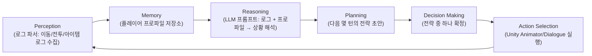
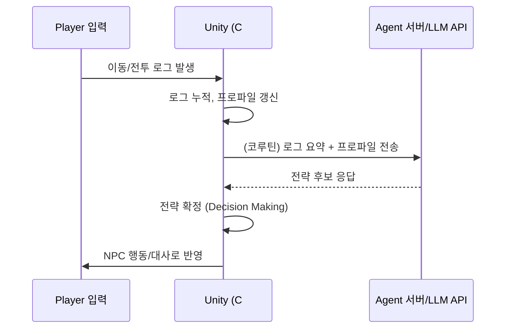

> **이 글은 예시(가상 시나리오)입니다.** 아직 STAR 구조로 실제 경험을 정리해보지 않은 상태라, "STAR 기법을 게임 프로젝트에 적용하면 이런 모습이 된다"는 걸 보여주기 위한 초안입니다. 실제로 유니티의 로그 기반 게임 프로젝트에 이 구조를 적용해보신 뒤, 여기 채워진 예시 내용을 진짜 겪은 문제·코드·수치로 바꿔 넣으시면 됩니다.

## 들어가며 (Situation)

로그 기반 게임 프로젝트에서 NPC는 보통 유한 상태 머신(FSM)으로 동작합니다. "플레이어가 가까이 오면 공격", "체력이 낮으면 도망" 같은 규칙을 미리 정해두는 방식이죠. 문제는, 이 NPC가 **플레이어가 지금까지 어떻게 플레이해왔는지(로그 히스토리)** 는 전혀 신경 쓰지 않는다는 점입니다. 매번 같은 패턴으로 싸우는 플레이어에게도, 처음 만난 플레이어에게도 NPC는 똑같이 반응합니다.

그래서 "NPC가 강해지는 것"이 아니라, **플레이어의 행동 로그를 보고 반응을 바꾸는 에이전트**를 만들어보자는 게 이번 예시 시나리오의 출발점입니다.

## 문제 상황 (Task)

구체적으로 풀어야 할 문제는 다음과 같습니다.

- 플레이어의 최근 행동(이동 패턴, 아이템 사용, 반복되는 전략)을 **로그로 기록하고 해석**해야 한다.
- 그 해석 결과를 바탕으로 NPC가 **대사나 전략을 바꾸는 의사결정**을 해야 한다.
- Unity(C#)는 실시간 렌더링 루프를 돌려야 하는데, LLM 호출처럼 **응답이 느릴 수 있는 작업**을 프레임 드랍 없이 처리해야 한다.
- 오프라인이거나 API 호출이 실패했을 때도 게임이 멈추면 안 된다.

## 해결 과정 (Action)

### 1. NPC 의사결정 방식 비교

| 방식 | 특징 | 플레이어 로그 반영 | 구현 난이도 |
|---|---|---|---|
| FSM (유한 상태 머신) | 상태와 전이 조건을 미리 정의 | 거의 불가능 (상태 폭발) | 낮음 |
| Utility AI | 각 행동에 점수를 매겨 최적 행동 선택 | 점수 계산식에 로그 반영 가능 | 중간 |
| GOAP (Goal-Oriented Action Planning) | 목표를 세우고 행동 시퀀스를 계획 | 목표 설정에 로그 반영 가능 | 높음 |
| **LLM 기반 Agent** | 로그를 자연어/구조화 데이터로 넘겨 판단 위임 | 맥락을 그대로 이해시킬 수 있음 | 높음 (통신·지연 관리 필요) |

FSM과 Utility AI는 "정해둔 규칙 안에서"만 반응하기 때문에, 플레이어의 새로운 패턴(예: "이 플레이어는 항상 왼쪽으로 돈다")을 유연하게 해석하기 어렵습니다. 반면 LLM 기반 Agent는 로그 데이터를 그대로 던져주고 "이 플레이어는 어떤 성향이고, 지금 어떻게 반응해야 할지"를 판단하게 할 수 있다는 점에서 선택했습니다.

### 2. 에이전트 구조 설계

Generative AI Agent의 표준 구조(Perception → Memory → Reasoning → Planning → Decision Making → Action Selection)를 Unity 프로젝트에 맞게 배치하면 다음과 같습니다.



- **Perception**: Unity 쪽에서 플레이어의 이동 좌표, 전투 이벤트, 아이템 사용을 로그(JSON)로 쌓습니다.
- **Memory**: 최근 N턴의 로그를 요약해 "플레이어 프로파일"로 저장합니다. (예: 공격적/방어적 성향 점수)
- **Reasoning**: 로그 요약과 프로파일을 LLM에 프롬프트로 전달해 "지금 이 플레이어에게 어떤 전략이 유효할지" 해석을 받습니다.
- **Planning / Decision Making**: LLM이 제안한 후보 전략 중 하나를 Unity 쪽 로직이 최종 확정합니다. (LLM에게 결정을 100% 맡기지 않고, 마지막 확정은 게임 로직이 검증하는 구조)
- **Action Selection**: 확정된 전략을 실제 Animator 파라미터나 대사 출력으로 옮깁니다.

### 3. Unity ↔ LLM 통신 흐름

프레임 드랍을 막기 위해, LLM 호출은 **코루틴으로 비동기 처리**하고 결과가 올 때까지는 NPC가 마지막으로 확정된 전략을 유지하도록 설계합니다.



```csharp
// 예시 코드 (실제 프로젝트 코드가 아닌, 구조를 보여주기 위한 스켈레톤입니다)
IEnumerator RequestAgentDecision(PlayerProfile profile)
{
    var request = BuildAgentRequest(profile);
    using (UnityWebRequest www = UnityWebRequest.Post(agentEndpoint, request))
    {
        yield return www.SendWebRequest();

        if (www.result != UnityWebRequest.Result.Success)
        {
            // 실패 시: 마지막 확정 전략 유지, 게임은 멈추지 않는다
            yield break;
        }

        var decision = ParseDecision(www.downloadHandler.text);
        ApplyDecision(decision); // Action Selection
    }
}
```

### 4. 시행착오 (예시)

- 처음엔 LLM 호출을 매 프레임마다 시도해서 요청이 쌓이는 문제가 있었다고 가정 → **일정 턴 수(예: 10턴)마다 한 번씩만 호출**하도록 제한.
- LLM 응답이 늦게 와서 NPC가 "멍때리는" 것처럼 보이는 문제 → 응답 대기 중에는 **이전 전략을 유지**하도록 폴백 처리.
- LLM이 게임 밸런스를 깨는 전략(너무 강함/약함)을 제안하는 문제 → Decision Making 단계에서 **Unity 쪽이 최종 검증**하도록 역할 분리.

## 결과 (Result)

아직 실제 구현 전이라 "달성한 결과"는 없지만, 이 구조를 실제로 만들면 아래 지표로 검증해볼 계획입니다.

| 검증 항목 | 목표 |
|---|---|
| LLM 호출로 인한 프레임 드랍 | 0 (코루틴 비동기 처리로 메인 스레드 블로킹 없음) |
| Agent 응답 지연 | 300ms~1s 내외 (호출 주기를 턴 단위로 제한) |
| API 실패 시 게임 동작 | 마지막 확정 전략 유지, 크래시 없음 |
| 플레이어 체감 | "매번 다르게 반응한다"는 피드백 (설문/플레이테스트로 확인 예정) |

## 더 학습하면 좋은 개념

- **GOAP(Goal-Oriented Action Planning)** — LLM 없이도 목표 기반으로 행동을 계획하는 전통적 게임 AI 기법. LLM 기반 Agent와 비교하면 장단점이 명확해진다.
- **프롬프트 엔지니어링 / 구조화 출력(Structured Output)** — LLM이 매번 다른 형식으로 답하면 파싱이 깨진다. JSON 스키마를 강제하는 방법을 알아야 안정적인 Action Selection이 가능하다.
- **Unity 비동기 처리 (Coroutine vs async/await vs UniTask)** — 네트워크 호출을 메인 스레드와 분리하는 여러 방식의 차이를 이해하면 성능 문제를 줄일 수 있다.
- **HCI 관점의 적응형 난이도/반응 설계** — "NPC가 강해지는 것"과 "플레이어와 상호작용하며 행동을 바꾸는 것"은 다른 문제다. 플레이어 경험(UX) 연구 관점을 곁들이면 설계가 더 탄탄해진다.
- **RAG(Retrieval-Augmented Generation)** — 플레이어 로그가 많아질수록 전부 프롬프트에 넣을 수 없다. 필요한 로그만 검색해서 넘기는 구조를 알아두면 Memory 단계를 확장하기 쉽다.

## 참고 자료

- [Unity Manual - Coroutines](https://docs.unity3d.com/Manual/Coroutines.html)
- [Unity Scripting API - UnityWebRequest](https://docs.unity3d.com/ScriptReference/Networking.UnityWebRequest.html)
- [Claude API 공식 문서 - Overview](https://docs.claude.com/en/api/overview)
